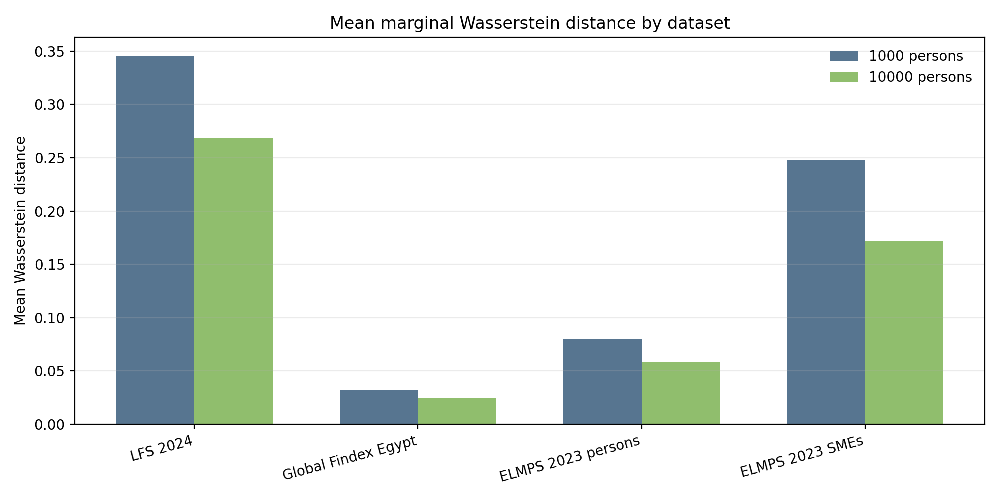
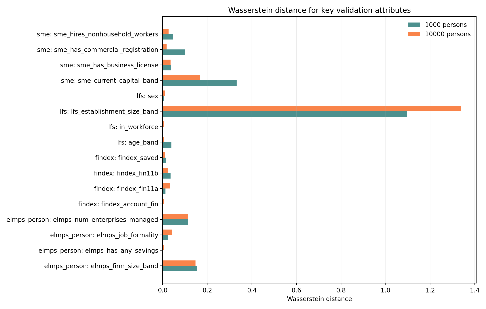
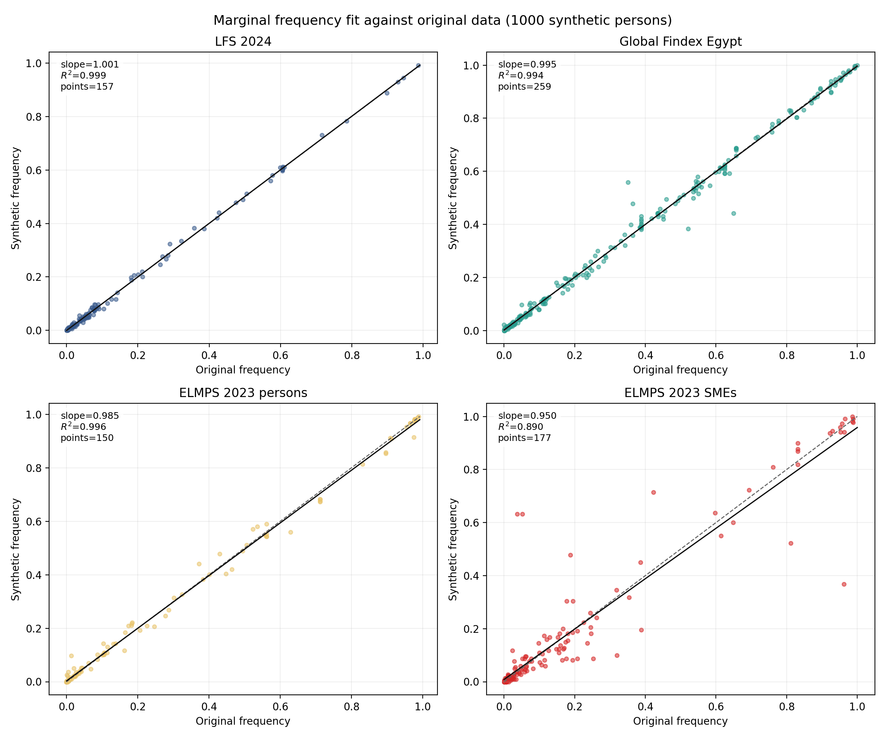
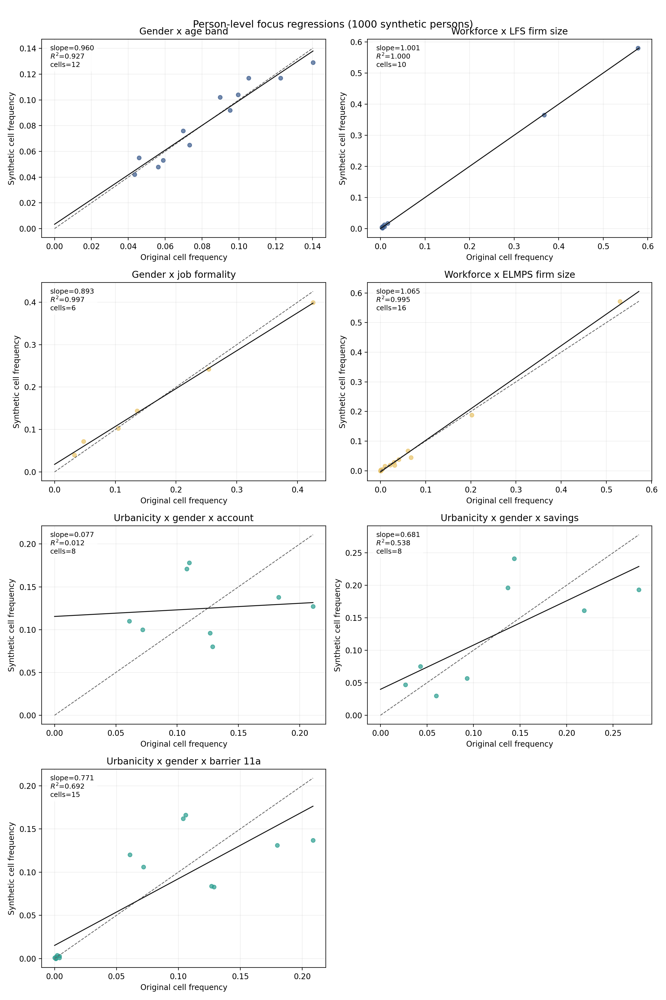
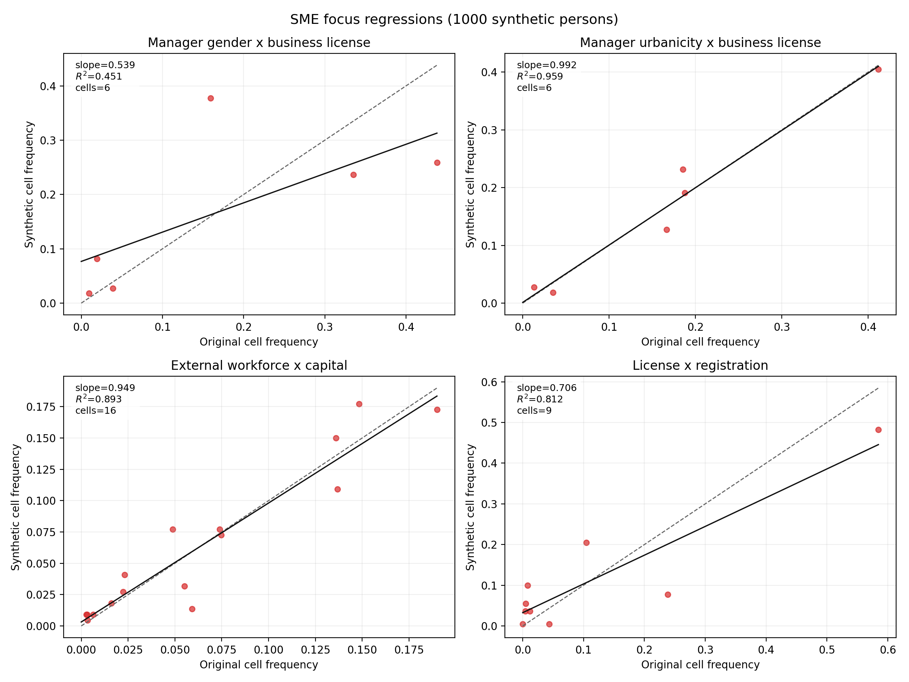
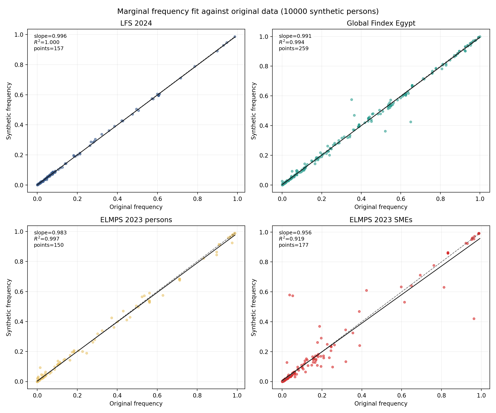
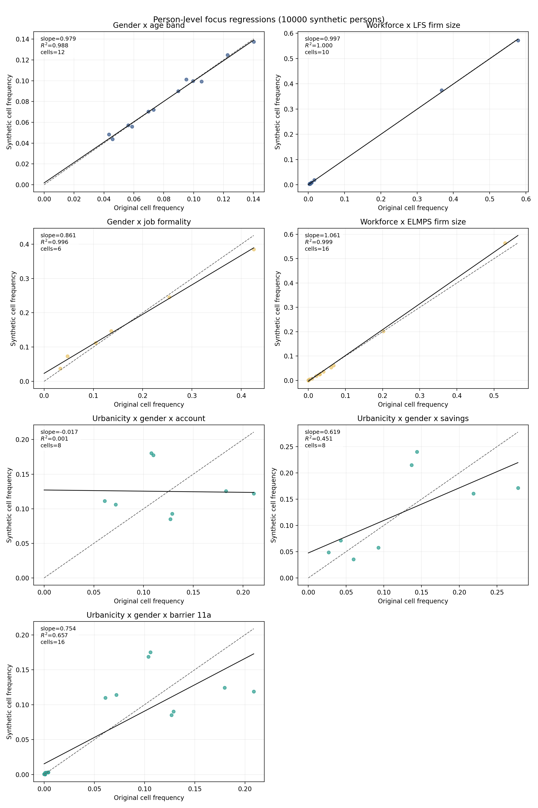
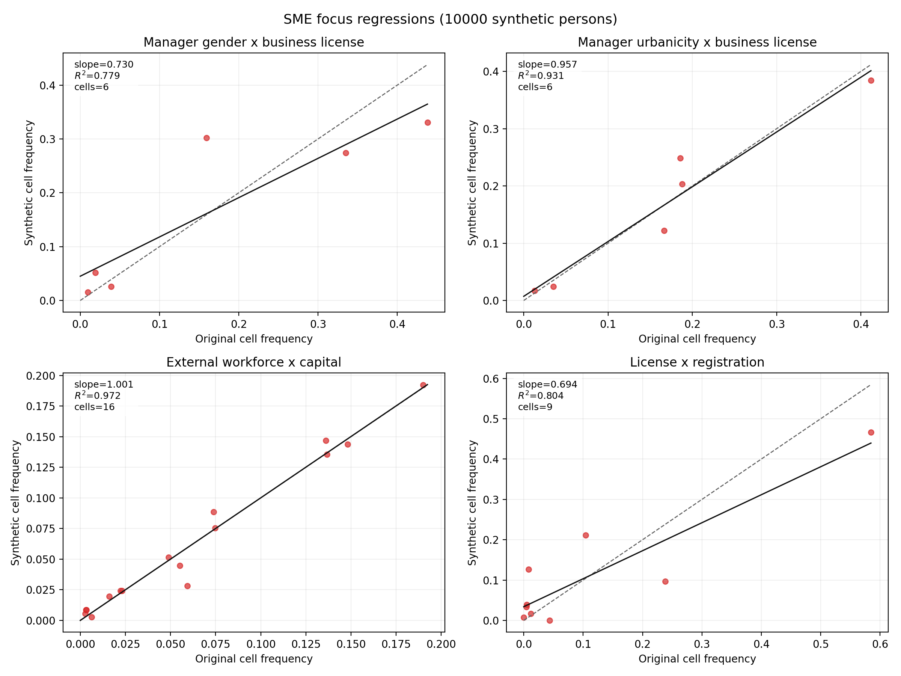

# Egypt Synthetic Population Validation

## Scope

This report validates the synthetic persons and SMEs generated in `model.py` against the harmonized source microdata from LFS 2024, Global Findex Egypt, ELMPS 2023 persons, and ELMPS 2023 enterprises.

The validation follows the same logic as the reference workflow: marginal Wasserstein distances, regression slopes and coefficients for selected joint distributions, and scatter plots comparing synthetic and original frequencies.

## Synthetic Population Profile

### Persons

| indicator | 1000 | 10000 |
| --- | --- | --- |
| Any account (%) | 45.0 | 47.9 |
| ELMPS any savings (%) | 8.4 | 8.1 |
| ELMPS bank account (%) | 2.1 | 1.9 |
| Formal financial account (%) | 38.6 | 39.5 |
| Formal job indicator (%) | 14.3 | 14.9 |
| In workforce (%) | 42.0 | 42.8 |
| Manages at least one SME (%) | 14.3 | 13.7 |
| Saved in last 12 months (%) | 20.9 | 21.3 |
| Synthetic persons | 1,000 | 10,000 |
| Urban (%) | 44.1 | 42.5 |
| Women (%) | 51.1 | 49.5 |

### SMEs

| indicator | 1000 | 10000 |
| --- | --- | --- |
| Any workers with social insurance (%) | 2.3 | 0.7 |
| Female-managed SMEs (%) | 47.7 | 36.9 |
| Has business license (%) | 31.8 | 32.6 |
| Has commercial registration (%) | 18.2 | 23.2 |
| Has online page/storefront (%) | 0.9 | 2.8 |
| Hires non-household workers (%) | 12.3 | 14.2 |
| Keeps accounting books (%) | 15.5 | 16.6 |
| SMEs per 100 persons | 22.0 | 22.0 |
| Synthetic SMEs | 220 | 2,199 |
| Urban-managed SMEs (%) | 45.0 | 46.9 |
| Uses mobile sales app (%) | 1.8 | 1.1 |

## Source Frames

- LFS 2024 persons: `199,751` rows
- Global Findex Egypt persons: `1,001` rows
- ELMPS 2023 persons: `41,734` rows
- ELMPS 2023 SMEs: `4,439` rows

## Wasserstein Summary

### 1000 synthetic persons

| dataset | mean | median | max |
| --- | --- | --- | --- |
| ELMPS 2023 persons | 0.0802 | 0.0397 | 0.3564 |
| Global Findex Egypt | 0.0317 | 0.0181 | 0.2084 |
| LFS 2024 | 0.3459 | 0.0575 | 2.2133 |
| ELMPS 2023 SMEs | 0.2475 | 0.0719 | 1.7229 |

### 10000 synthetic persons

| dataset | mean | median | max |
| --- | --- | --- | --- |
| ELMPS 2023 persons | 0.0588 | 0.0393 | 0.3496 |
| Global Findex Egypt | 0.0250 | 0.0131 | 0.2244 |
| LFS 2024 | 0.2687 | 0.0263 | 1.4540 |
| ELMPS 2023 SMEs | 0.1722 | 0.0325 | 1.5892 |

## Largest Marginal Mismatches

### Top 10 Wasserstein distances for 1000 synthetic persons

| dataset | attribute | wasserstein |
| --- | --- | --- |
| LFS 2024 | lfs_contract_type | 2.2133 |
| ELMPS 2023 SMEs | age_band | 1.7229 |
| LFS 2024 | lfs_industry_group | 1.7124 |
| LFS 2024 | lfs_occupation_group | 1.4839 |
| ELMPS 2023 SMEs | sme_workplace_type | 1.1342 |
| LFS 2024 | lfs_establishment_size_band | 1.0949 |
| ELMPS 2023 SMEs | sme_enterprise_age_band | 0.6924 |
| ELMPS 2023 SMEs | in_workforce | 0.5944 |
| ELMPS 2023 SMEs | education_level | 0.4713 |
| LFS 2024 | lfs_region | 0.4637 |

### Top 10 Wasserstein distances for 10000 synthetic persons

| dataset | attribute | wasserstein |
| --- | --- | --- |
| ELMPS 2023 SMEs | age_band | 1.5892 |
| LFS 2024 | lfs_occupation_group | 1.4540 |
| LFS 2024 | lfs_contract_type | 1.4132 |
| LFS 2024 | lfs_industry_group | 1.3617 |
| LFS 2024 | lfs_establishment_size_band | 1.3396 |
| ELMPS 2023 SMEs | sme_workplace_type | 0.7499 |
| ELMPS 2023 SMEs | sme_enterprise_age_band | 0.5864 |
| ELMPS 2023 SMEs | in_workforce | 0.5424 |
| ELMPS 2023 persons | age_band | 0.3496 |
| ELMPS 2023 SMEs | sme_enterprise_activity_1digit | 0.2896 |

## Regression Metrics For Selected Joint Distributions

### 1000 synthetic persons

| dataset | label | columns | slope | r2 | num_cells |
| --- | --- | --- | --- | --- | --- |
| LFS 2024 | Gender x age band | sex x age_band | 0.9598 | 0.9269 | 12 |
| LFS 2024 | Workforce x LFS firm size | in_workforce x lfs_establishment_size_band | 1.0005 | 0.9999 | 10 |
| ELMPS 2023 persons | Gender x job formality | sex x elmps_job_formality | 0.8933 | 0.9968 | 6 |
| ELMPS 2023 persons | Workforce x ELMPS firm size | in_workforce x elmps_firm_size_band | 1.0652 | 0.9948 | 16 |
| Global Findex Egypt | Urbanicity x gender x account | urban_rural x sex x findex_account_fin | 0.0768 | 0.0121 | 8 |
| Global Findex Egypt | Urbanicity x gender x savings | urban_rural x sex x findex_saved | 0.6806 | 0.5384 | 8 |
| Global Findex Egypt | Urbanicity x gender x barrier 11a | urban_rural x sex x findex_fin11a | 0.7712 | 0.6918 | 15 |
| ELMPS 2023 SMEs | Manager gender x business license | sex x sme_has_business_license | 0.5392 | 0.4507 | 6 |
| ELMPS 2023 SMEs | Manager urbanicity x business license | urban_rural x sme_has_business_license | 0.9923 | 0.9595 | 6 |
| ELMPS 2023 SMEs | External workforce x capital | sme_hires_nonhousehold_workers x sme_current_capital_band | 0.9494 | 0.8931 | 16 |
| ELMPS 2023 SMEs | License x registration | sme_has_business_license x sme_has_commercial_registration | 0.7063 | 0.8121 | 9 |

### 10000 synthetic persons

| dataset | label | columns | slope | r2 | num_cells |
| --- | --- | --- | --- | --- | --- |
| LFS 2024 | Gender x age band | sex x age_band | 0.9790 | 0.9879 | 12 |
| LFS 2024 | Workforce x LFS firm size | in_workforce x lfs_establishment_size_band | 0.9975 | 0.9997 | 10 |
| ELMPS 2023 persons | Gender x job formality | sex x elmps_job_formality | 0.8606 | 0.9957 | 6 |
| ELMPS 2023 persons | Workforce x ELMPS firm size | in_workforce x elmps_firm_size_band | 1.0613 | 0.9988 | 16 |
| Global Findex Egypt | Urbanicity x gender x account | urban_rural x sex x findex_account_fin | -0.0167 | 0.0006 | 8 |
| Global Findex Egypt | Urbanicity x gender x savings | urban_rural x sex x findex_saved | 0.6193 | 0.4512 | 8 |
| Global Findex Egypt | Urbanicity x gender x barrier 11a | urban_rural x sex x findex_fin11a | 0.7540 | 0.6570 | 16 |
| ELMPS 2023 SMEs | Manager gender x business license | sex x sme_has_business_license | 0.7297 | 0.7787 | 6 |
| ELMPS 2023 SMEs | Manager urbanicity x business license | urban_rural x sme_has_business_license | 0.9566 | 0.9311 | 6 |
| ELMPS 2023 SMEs | External workforce x capital | sme_hires_nonhousehold_workers x sme_current_capital_band | 1.0014 | 0.9724 | 16 |
| ELMPS 2023 SMEs | License x registration | sme_has_business_license x sme_has_commercial_registration | 0.6939 | 0.8039 | 9 |

## Notes

- Wasserstein distances are computed on the harmonized discrete state supports of each attribute.
- Regression slopes and $R^2$ values come from linear regressions between original and synthetic normalized cell frequencies.
- The selected joint distributions emphasize the combinations requested for validation: gender, job formality, SME formality, workforce and firm size, urbanicity, and financial behaviour including savings, account ownership, and barriers.
